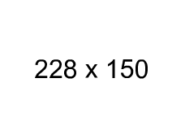

# Free image

[](https://travis-ci.org/MKFMIKU/FreeImage)

An [npm](http://npmjs.org) module for generating random images.

Available as a command line tool.

## Example



## Usage

### Command Line

```
npm install -g free-image-generator

freeimage 800 600 sample.png
```